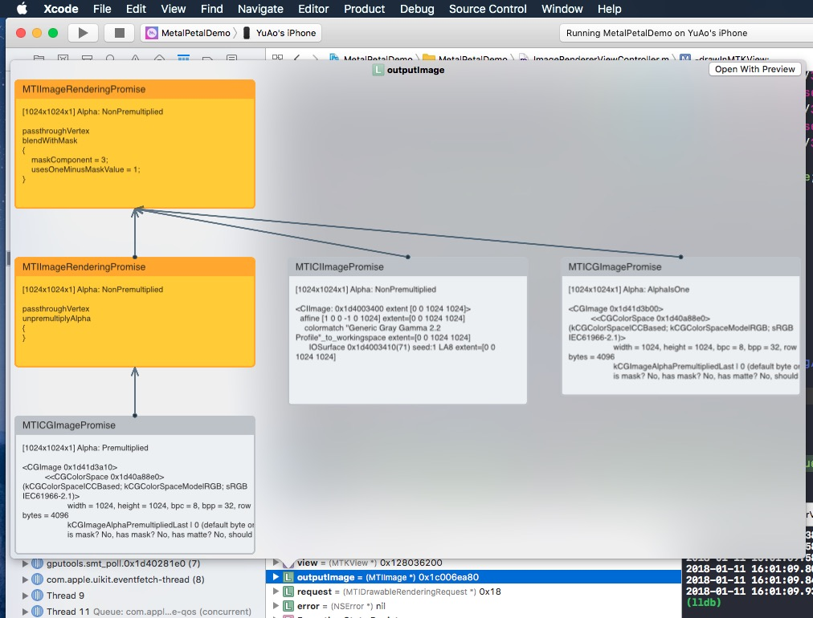

# MetalPetal

[](#)
[](#)
[](#)

An image processing framework based on Metal.

<!-- TOC depthFrom:2 -->

- [Design Overview](#design-overview)
    - [Goals](#goals)
    - [Core Components](#core-components)
        - [MTIContext](#mticontext)
        - [MTIImage](#mtiimage)
        - [MTIFilter](#mtifilter)
        - [MTIKernel](#mtikernel)
    - [Alpha Type Handling](#alpha-type-handling)
    - [Optimizations](#optimizations)
    - [Concurrency Considerations](#concurrency-considerations)
    - [Advantages over Core Image](#advantages-over-core-image)
    - [Extensions](#extensions)
        - [Working with SceneKit](#working-with-scenekit)
        - [Working with Core Image](#working-with-core-image)
        - [Working with JavaScript](#working-with-javascript)
        - [Texture Loader](#texture-loader)
- [Builtin Filters](#builtin-filters)
- [Example Code](#example-code)
    - [Create a `MTIImage`](#create-a-mtiimage)
    - [Create a Filtered Image](#create-a-filtered-image)
    - [Render a `MTIImage`](#render-a-mtiimage)
    - [Connecting Filters (Swift)](#connecting-filters-swift)
- [Quick Look Debug Support](#quick-look-debug-support)
- [Best Practices](#best-practices)
- [Build Custom Filter](#build-custom-filter)
    - [Shader Function Arguments Encoding](#shader-function-arguments-encoding)
    - [Simple Single Input / Output Filters](#simple-single-input--output-filters)
    - [Fully Custom Filters](#fully-custom-filters)
    - [Multiple Draw Calls in One Render Pass](#multiple-draw-calls-in-one-render-pass)
    - [Custom Vertex Data](#custom-vertex-data)
    - [Custom Processing Module](#custom-processing-module)
- [Install](#install)
    - [CocoaPods](#cocoapods)
    - [Swift Package Manager](#swift-package-manager)
- [iOS Simulator Support](#ios-simulator-support)
- [Trivia](#trivia)
- [Contribute](#contribute)
- [License](#license)

<!-- /TOC -->

## Design Overview

MetalPetal is an image processing framework based on [Metal](https://developer.apple.com/metal/) designed to provide real-time processing for still image and video with easy to use programming interfaces.

This chapter covers the key concepts of MetalPetal, and will help you to get a better understanding of its design, implementation, performance implications and best practices.

### Goals

MetalPetal is designed with the following goals in mind.

- Easy to use API

    Provides convenience APIs and avoids common pitfalls.

- Performance

    Use CPU, GPU and memory efficiently.

- Extensibility

    Easy to create custom filters as well as plugin your custom image processing unit.

- Swifty

    Provides a fluid experience for Swift programmers.

### Core Components

Some of the core concepts of MetalPetal are very similar to those in Apple's Core Image framework.

#### MTIContext

Provides an evaluation context for rendering `MTIImage`s. It also stores a lot of caches and state information, so it's more efficient to reuse a context whenever possible.

#### MTIImage

 A `MTIImage` object is a representation of an image to be processed or produced. It does directly represent image bitmap data instead it has all the information necessary to produce an image or more precisely a `MTLTexture`. It consists of two parts, a recipe of how to produce the texture (`MTIImagePromise`) and other information such as how a context caches the image (`cachePolicy`), and how the texture should be sampled (`samplerDescriptor`).

#### MTIFilter

A `MTIFilter` represents an image processing effect and any parameters that control that effect. It produces a `MTIImage` object as output. To use a filter, you create a filter object, set its input images and parameters, and then access its output image. Typically, a filter class owns a static kernel (`MTIKernel`), when you access its `outputImage` property, it asks the kernel with the input images and parameters to produce an output `MTIImage`. 

#### MTIKernel

A `MTIKernel` represents an image processing routine. `MTIKernel` is responsible for creating the cooresponding render or compute pipeline state for the filter, as well as building the `MTIImagePromise` for a `MTIImage`.

### Alpha Type Handling

If an alpha channel is used in an image, there are two common representations that are available: unpremultiplied (straight/unassociated) alpha, and premultiplied (associated) alpha.

With unpremultiplied alpha, the RGB components represent the color of the pixel, disregarding its opacity.

With premultiplied alpha, the RGB components represent the color of the pixel, adjusted for its opacity by multiplication.

Most of the filters in MetalPetal accept unpremultiplied alpha and opaque images and output unpremultiplied alpha images. Some filters, such as  `MTIMultilayerCompositingFilter` accepts both unpremultiplied/premultiplied alpha images.

MetalPetal handles alpha type explicitly. You are responsible for providing the correct alpha type during image creation.

There are three alpha types in MetalPetal.

`MTIAlphaType.nonPremultiplied`: the alpha value in the image is not premultiplied.

`MTIAlphaType.premultiplied`: the alpha value in the image is premultiplied.

`MTIAlphaType.alphaIsOne`: there's no alpha channel in the image or the image is opaque.

Typically, `CGImage`, `CVPixelBuffer`, `CIImage` objects have premultiplied alpha channel. `MTIAlphaType.alphaIsOne` is strongly recommanded if the image is opaque, e.g. a `CVPixelBuffer` from camera feed, or a `CGImage` loaded from a `jpg` file.

You can call `unpremultiplyingAlpha()` or `premultiplyingAlpha()` on a `MTIImage` to convert the alpha type of the image.

For performance reasons, alpha type validation only happens in debug build.

### Optimizations

MetalPetal does a lot of optimizations for you under the hood.

It automatically caches functions, kernel states, samplers, etc.

Before rendering, MetalPetal can look into your image render graph and figure out the minimal number of intermedinate textures needed to do the rendering, saving memory, energy and time.

It can also re-organize the image render graph if multiple “recipes” can be concatenated to eliminate redundant render passes. (`MTIContext.isRenderGraphOptimizationEnabled`)

### Concurrency Considerations

`MTIImage` objects are immutable, which means they can be shared safely among threads.

However, `MTIFilter` objects are mutable and thus cannot be shared safely among threads.

A `MTIContext` contains a lot of states and caches. There's a thread-safe mechanism for `MTIContext` objects, making it safe to share a `MTIContext` object among threads.

### Advantages over Core Image

- Fully customizable vertex and fragment functions.

- MRT (Multiple Render Targets) support.

- Generally better performance. (Detailed benchmark data needed)

### Extensions

#### Working with SceneKit

You can use `MTISCNSceneRenderer` to generate `MTIImage`s from a `SCNScene`. You may want to handle the SceneKit renderer's linear RGB color space, see issue [#76 The image from SceneKit is darker than normal](https://github.com/MetalPetal/MetalPetal/issues/76).

#### Working with Core Image

You can create `MTIImage`s from `CIImage`s.

You can render a `MTIImage` to a `CIImage` using a `MTIContext`.

You can use a `CIFilter` directly with `MTICoreImageKernel` or the `MTICoreImageUnaryFilter` class. (Swift Only)

#### Working with JavaScript

See [MetalPetalJS](https://github.com/MetalPetal/MetalPetalJS)

With MetalPetalJS you can create render pipelines and filters using JavaScript, making it possible to download your filters/renderers from "the cloud".

#### Texture Loader

MetalPetal, by default, uses `MTKTextureLoader` to load `CGImage`s, images from `URL`, and named images.

You can custom this behavior by implementing the `MTITextureLoader` protocol. Then assign your texture loader class to `MTIContextOptions.textureLoaderClass` when creating a `MTIContext`.

## Builtin Filters

- Color Matrix

- Color Lookup

    Uses an color lookup table to remap the colors in an image.

- Opacity

- Exposure

- Saturation

- Brightness

- Contrast

- Color Invert

- Vibrance

    Adjusts the saturation of an image while keeping pleasing skin tones.

- RGB Tone Curve

- Blend Modes

    - Normal
    - Multiply
    - Overlay
    - Screen
    - Hard Light
    - Soft Light
    - Darken
    - Lighten
    - Color Dodge
    - Add (Linear Dodge)
    - Color Burn
    - Linear Burn
    - Lighter Color
    - Darker Color
    - Vivid Light
    - Linear Light
    - Pin Light
    - Hard Mix
    - Difference
    - Exclusion
    - Subtract
    - Divide
    - Hue
    - Saturation
    - Color
    - Luminosity
    - ColorLookup512x512

- Blend with Mask

- Transform

- Crop

- Pixellate

- Multilayer Composite

- MPS Convolution

- MPS Gaussian Blur

- MPS Definition

- MPS Sobel

- MPS Unsharp Mask

- MPS Box Blur

- [High Pass Skin Smoothing](https://github.com/YuAo/YUCIHighPassSkinSmoothing)

- [CLAHE (Contrast-Limited Adaptive Histogram Equalization)](https://github.com/YuAo/Accelerated-CLAHE)

- [Lens Blur (Hexagonal Bokeh Blur)](https://github.com/YuAo/HexagonalBokehBlur)

- [Surface Blur](https://github.com/MetalPetal/SurfaceBlur)

- Bulge Distortion

- Chroma Key Blend

- Color Halftone

- Dot Screen

- All Core Image Filters

## Example Code

### Create a `MTIImage`

```Swift
let imageFromCGImage = MTIImage(cgImage: cgImage, options: [.SRGB: false])

let imageFromCIImage = MTIImage(ciImage: ciImage)

let imageFromCoreVideoPixelBuffer = MTIImage(cvPixelBuffer: pixelBuffer, alphaType: .alphaIsOne)

let imageFromContentsOfURL = MTIImage(contentsOf: url, options: [.SRGB: false])

// unpremultiply alpha if needed
let unpremultipliedAlphaImage = image.unpremultiplyingAlpha()
```

### Create a Filtered Image

```Swift
let inputImage = ...

let filter = MTISaturationFilter()
filter.saturation = 0
filter.inputImage = inputImage

let outputImage = filter.outputImage
```

### Render a `MTIImage`

```Swift
let options = MTIContextOptions()

guard let device = MTLCreateSystemDefaultDevice(), let context = try? MTIContext(device: device, options: options) else {
    return
}

let image: MTIImage = ...

do {
    try context.render(image, to: pixelBuffer) 
    
    //context.makeCIImage(from: image)
    
    //context.makeCGImage(from: image)
} catch {
    print(error)
}
```

### Connecting Filters (Swift)

MetalPetal has a type-safe Swift API for connecting filters. You can use `=>` operator in `FilterGraph.makeImage` function to connect filters and get the output image.

Here are some examples:

```Swift
let image = try? FilterGraph.makeImage { output in
    inputImage => saturationFilter => exposureFilter => output
}
```

```Swift
let image = try? FilterGraph.makeImage { output in
    inputImage => saturationFilter => exposureFilter => contrastFilter => blendFilter.inputPorts.inputImage
    exposureFilter => blendFilter.inputPorts.inputBackgroundImage
    blendFilter => output
}
```

- You can connect unary filters (`MTIUnaryFilter`) directly using `=>`.

- For a filter with multiple inputs, you need to connect to one of its `inputPorts`.

- `=>` operator only works in `FilterGraph.makeImage` method.

- One and only one filter's output can be connected to `output`.

## Quick Look Debug Support

If you do a Quick Look on a `MTIImage`, it'll show you the image graph that you constructed to produce that image.



## Best Practices

- Reuse a `MTIContext` whenever possible.

    Contexts are heavyweight objects, so if you do create one, do so as early as possible, and reuse it each time you need to render an image.

- Use `MTIImage.cachePolicy` wisely.
    
    Use `MTIImageCachePolicyTransient` when you do not want to preserve the render result of an image, for example when the image is just an intermediate result in a filter chain, so the underlying texture of the render result can be reused. It is the most memory efficient option. However, when you ask the context to render a previously rendered image, it may re-render that image since its underlying texture has been reused.
    
    By default, a filter's output image has the `transient` policy.

    Use `MTIImageCachePolicyPersistent` when you want to prevent the underlying texture from being reused.
    
    By default, images created from external sources have the `persistent` policy.

- Understand that `MTIFilter.outputImage` is a compute property.

    Each time you ask a filter for its output image, the filter may give you a new output image object even if the inputs are identical with the previous call. So reuse output images whenever possible.
    
    For example,

     ```Swift
    //          ╭→ filterB
    // filterA ─┤
    //          ╰→ filterC
    // 
    // filterB and filterC use filterA's output as their input.
    ```
    In this situation, the following solution:
    
    ```Swift
    let filterOutputImage = filterA.outputImage
    filterB.inputImage = filterOutputImage
    filterC.inputImage = filterOutputImage
    ```
    
    is better than:

    ```Swift
    filterB.inputImage = filterA.outputImage
    filterC.inputImage = filterA.outputImage
    ```

## Build Custom Filter

If you want to include the `MTIShaderLib.h` in your `.metal` file, you need to add the path of `MTIShaderLib.h` file to the `Metal Compiler - Header Search Paths` (`MTL_HEADER_SEARCH_PATHS`) setting.

For example, if you use CocoaPods you can set the `MTL_HEADER_SEARCH_PATHS` to  `${PODS_CONFIGURATION_BUILD_DIR}/MetalPetal/MetalPetal.framework/Headers` or `${PODS_ROOT}/MetalPetal/Frameworks/MetalPetal/Shaders`. If you use Swift Package Manager, set the `MTL_HEADER_SEARCH_PATHS` to `$(HEADER_SEARCH_PATHS)`

### Shader Function Arguments Encoding

MetalPetal has a built-in mechanism to encode shader function arguments for you. You can pass the shader function arguments as `name: value` dictionaries to the `MTIRenderPipelineKernel.apply(toInputImages:parameters:outputDescriptors:)`, `MTIRenderCommand(kernel:geometry:images:parameters:)`, etc.

For example, the parameter dictionary for the metal function `vibranceAdjust` can be:

```Swift
// Swift
let amount: Float = 1.0
let vibranceVector = float4(1, 1, 1, 1)
let parameters = ["amount": amount,
                  "vibranceVector": MTIVector(value: vibranceVector),
                  "avoidsSaturatingSkinTones": true,
                  "grayColorTransform": MTIVector(value: float3(0,0,0))]
```

```Metal
// vibranceAdjust metal function
fragment float4 vibranceAdjust(...,
                constant float & amount [[ buffer(0) ]],
                constant float4 & vibranceVector [[ buffer(1) ]],
                constant bool & avoidsSaturatingSkinTones [[ buffer(2) ]],
                constant float3 & grayColorTransform [[ buffer(3) ]])
{
    ...
}

```

The shader function argument types and the coorresponding types to use in a parameter dictionary is listed below.

| Shader Function Argument Type | Swift | Objective-C | 
| :--- | :--- | :--- |
| float | Float | float |
| int | Int32 | int |
| uint | UInt32 | uint |
| bool | Bool | bool |
| simd (float2,float4,float4x4,int4, etc.) | MTIVector | MTIVector |
| struct | Data / MTIDataBuffer | NSData / MTIDataBuffer |
| other (float *, struct *, etc.) immutable | Data / MTIDataBuffer | NSData / MTIDataBuffer |
| other (float *, struct *, etc.) mutable | MTIDataBuffer | MTIDataBuffer |

### Simple Single Input / Output Filters

To build a custom unary filter, you can subclass `MTIUnaryImageRenderingFilter` and override the methods in the `SubclassingHooks` category. Examples: `MTIPixellateFilter`, `MTIVibranceFilter`, `MTIUnpremultiplyAlphaFilter`, `MTIPremultiplyAlphaFilter`, etc.

```ObjectiveC
//Objective-C

@interface MTIPixellateFilter : MTIUnaryImageRenderingFilter

@property (nonatomic) float fractionalWidthOfAPixel;

@end

@implementation MTIPixellateFilter

- (instancetype)init {
    if (self = [super init]) {
        _fractionalWidthOfAPixel = 0.05;
    }
    return self;
}

+ (MTIFunctionDescriptor *)fragmentFunctionDescriptor {
    return [[MTIFunctionDescriptor alloc] initWithName:@"pixellateEffect" libraryURL:[bundle URLForResource:@"default" withExtension:@"metallib"]];
}

- (NSDictionary<NSString *,id> *)parameters {
    return @{@"fractionalWidthOfAPixel": @(self.fractionalWidthOfAPixel)};
}

@end
```

```Swift
//Swift

class MTIPixellateFilter: MTIUnaryImageRenderingFilter {
    
    var fractionalWidthOfAPixel: Float = 0.05

    override var parameters: [String : Any] {
        return ["fractionalWidthOfAPixel": fractionalWidthOfAPixel]
    }
    
    override class func fragmentFunctionDescriptor() -> MTIFunctionDescriptor {
        return MTIFunctionDescriptor(name: "pixellateEffect", libraryURL: MTIDefaultLibraryURLForBundle(Bundle.main))
    }
}
```

### Fully Custom Filters

To build more complex filters, all you need to do is create a kernel (`MTIRenderPipelineKernel`/`MTIComputePipelineKernel`/`MTIMPSKernel`), then apply the kernel to the input image(s). Examples: `MTIChromaKeyBlendFilter`, `MTIBlendWithMaskFilter`, `MTIColorLookupFilter`, etc.

```ObjectiveC

@interface MTIChromaKeyBlendFilter : NSObject <MTIFilter>

@property (nonatomic, strong, nullable) MTIImage *inputImage;

@property (nonatomic, strong, nullable) MTIImage *inputBackgroundImage;

@property (nonatomic) float thresholdSensitivity;

@property (nonatomic) float smoothing;

@property (nonatomic) MTIColor color;

@end

@implementation MTIChromaKeyBlendFilter

@synthesize outputPixelFormat = _outputPixelFormat;

+ (MTIRenderPipelineKernel *)kernel {
    static MTIRenderPipelineKernel *kernel;
    static dispatch_once_t onceToken;
    dispatch_once(&onceToken, ^{
        kernel = [[MTIRenderPipelineKernel alloc] initWithVertexFunctionDescriptor:[[MTIFunctionDescriptor alloc] initWithName:MTIFilterPassthroughVertexFunctionName] fragmentFunctionDescriptor:[[MTIFunctionDescriptor alloc] initWithName:@"chromaKeyBlend"]];
    });
    return kernel;
}

- (instancetype)init {
    if (self = [super init]) {
        _thresholdSensitivity = 0.4;
        _smoothing = 0.1;
        _color = MTIColorMake(0.0, 1.0, 0.0, 1.0);
    }
    return self;
}

- (MTIImage *)outputImage {
    if (!self.inputImage || !self.inputBackgroundImage) {
        return nil;
    }
    return [self.class.kernel applyToInputImages:@[self.inputImage, self.inputBackgroundImage]
                                      parameters:@{@"color": [MTIVector vectorWithFloat4:(simd_float4){self.color.red, self.color.green, self.color.blue,self.color.alpha}],
                                    @"thresholdSensitivity": @(self.thresholdSensitivity),
                                               @"smoothing": @(self.smoothing)}
                         outputTextureDimensions:MTITextureDimensionsMake2DFromCGSize(self.inputImage.size)
                               outputPixelFormat:self.outputPixelFormat];
}

@end
```

### Multiple Draw Calls in One Render Pass

You can use `MTIRenderCommand` to issue multiple draw calls in one render pass.

```Swift
// Create a draw call with kernelA, geometryA, and imageA.
let renderCommandA = MTIRenderCommand(kernel: self.kernelA, geometry: self.geometryA, images: [imageA], parameters: [:])

// Create a draw call with kernelB, geometryB, and imageB.
let renderCommandB = MTIRenderCommand(kernel: self.kernelB, geometry: self.geometryB, images: [imageB], parameters: [:])

// Create an output descriptor
let outputDescriptor = MTIRenderPassOutputDescriptor(dimensions: MTITextureDimensions(width: outputWidth, height: outputHeight, depth: 1), pixelFormat: .bgra8Unorm, loadAction: .clear, storeAction: .store)

// Get the output images, the output image count is equal to the output descriptor count.
let images = MTIRenderCommand.images(byPerforming: [renderCommandA, renderCommandB], outputDescriptors: [outputDescriptor])
```

You can also create multiple output descriptors to output multiple images in one render pass (MRT, See https://en.wikipedia.org/wiki/Multiple_Render_Targets).

### Custom Vertex Data

When `MTIVertex` cannot fit your needs, you can implement the `MTIGeometry` protocol to provide your custom vertex data to the command encoder.

Use the `MTIRenderCommand` API to issue draw calls and pass your custom `MTIGeometry`.

### Custom Processing Module

In rare scenarios, you may want to access the underlying texture directly, use multiple MPS kernels in one render pass, do 3D rendering, or encode the render commands yourself.

`MTIImagePromise` protocol provides direct access to the underlying texture and the render context for a step in MetalPetal.

You can create new input sources or fully custom processing unit by implementing `MTIImagePromise` protocol. You will need to import an additional module to do so. 

Objective-C

```
@import MetalPetal.Extension;
```

Swift

```
// CocoaPods
import MetalPetal.Extension

// Swift Package Manager
import MetalPetalObjectiveC.Extension
```

See the implementation of `MTIComputePipelineKernel`, `MTICLAHELUTRecipe` or `MTIImage` for example.

## Install

### CocoaPods

You can use [CocoaPods](https://cocoapods.org/) to install the lastest version.

```
use_frameworks!

pod 'MetalPetal'

# If you are using Swift
pod 'MetalPetal/Swift'

```

We also provide a script to generate dynamic `.framework`s for you. You need to first install [CocoaPods/Rome](https://github.com/CocoaPods/Rome), then run [Rome/build_frameworks.sh](Rome/build_frameworks.sh)

### Swift Package Manager

This repo contains a package description file. However using Swift Package Manager is not supported until [SE-0271](https://github.com/apple/swift-evolution/blob/master/proposals/0271-package-manager-resources.md) is fully implemented.

## iOS Simulator Support

MetalPetal can run on Simulator with Xcode 11+ and macOS 10.15+.

`MetalPerformanceShaders.framework` is not available on Simulator, so filters rely on `MetalPerformanceShaders`, such as `MTIMPSGaussianBlurFilter`, `MTICLAHEFilter`, do not work.

Simulator supports fewer features or different implementation limits than an actual Apple GPU. See [Developing Metal Apps that Run in Simulator](https://developer.apple.com/documentation/metal/developing_metal_apps_that_run_in_simulator) for detail.

## Trivia

[Why Objective-C?](https://github.com/MetalPetal/MetalPetal/issues/52)

## Contribute

Thank you for considering contributing to MetalPetal. Please read our [Contributing Guidelines](CONTRIBUTING.md).

## License

MetalPetal is MIT-licensed. [LICENSE](LICENSE)

The files in the `/MetalPetalDemo` directory are licensed under a separate license. [LICENSE.md](MetalPetalDemo/LICENSE.md)

Documentation is licensed CC-BY-4.0.
